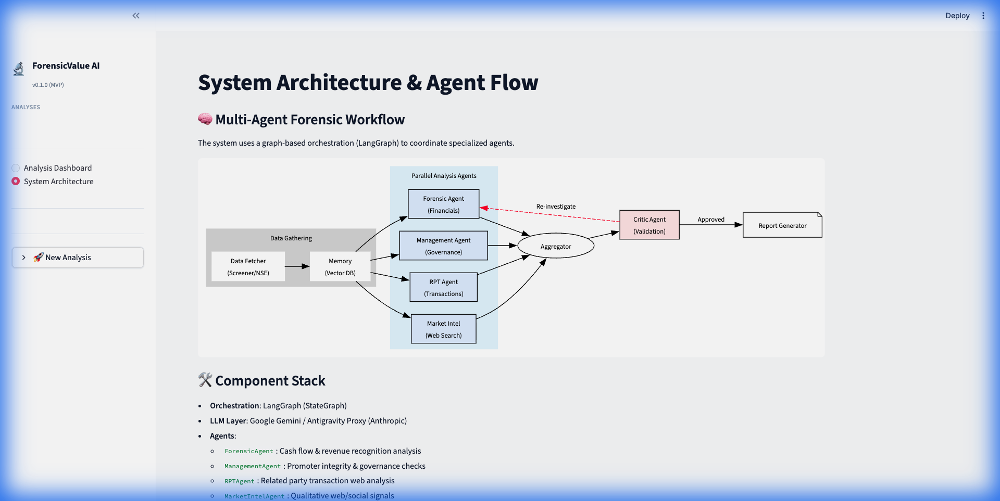

# ForensicValue AI

> Multi-agent forensic accounting platform for Indian equity markets.

ForensicValue AI uses a team of specialized LLM-powered agents to detect accounting irregularities, governance red flags, and related party transaction risks in Indian listed companies.

## Architecture



```
Data Sources → Memory Load → Parallel Agents → Critic → Report
                               ├── Forensic
                               ├── Management
                               ├── RPT
                               └── Market Intelligence (New)
```

## App Components (Routes)

- **Analysis Dashboard**: The main interface for viewing detailed forensic reports for individual companies. Shows risk scores, detailed findings, and data depth metrics.
- **Batch Runner**: A dedicated tool for managing large-scale analysis. Includes a pre-loaded list of 50 NSE Microcap companies and batch execution controls.
- **System Architecture**: A visual representation of the multi-agent workflow and component stack.

## Quick Start

### 1. Setup
```bash
# Clone and enter directory
cd forensic-value-ai

# Create virtual environment
python -m venv venv && source venv/bin/activate

# Install dependencies
pip install -r requirements.txt

# Configure environment
cp .env.example .env
# Edit .env — set GOOGLE_API_KEY (free tier) or OPENROUTER_API_KEY
```

### 2. Run Analysis (CLI)
```bash
# Analyze a single company (fetches data + runs agents)
python mvp_run.py INFY

# Analyze a batch
python mvp_run.py --batch "TCS,INFY,WIPRO"
```

### 3. Launch Dashboard
```bash
streamlit run dashboard.py
```
Access the dashboard at `http://localhost:8501`.

## Project Structure

```
forensic-value-ai/
├── dashboard.py              # Streamlit research dashboard
├── mvp_run.py                # CLI runner (MVP)
├── data/                     # Local data storage (JSON)
│   ├── reports/              # Final analysis reports
│   ├── company_cache/        # Raw fetched data
│   └── tickers.json          # Microcap list
├── src/
│   ├── config.py             # Pydantic settings
│   ├── llm/
│   │   ├── provider.py       # Multi-provider abstraction
│   │   └── prompts.py        # Agent prompt templates
│   ├── agents/
│   │   ├── base.py           # Base agent class
│   │   ├── forensic.py       # Forensic Accounting Agent
│   │   ├── management.py     # Management Integrity Agent
│   │   ├── rpt.py            # Related Party Transaction Agent
│   │   └── critic.py         # Critic/Validator Agent
│   ├── graph/
│   │   ├── state.py          # LangGraph state definition
│   │   └── workflow.py       # Workflow orchestrator
│   ├── data/
│   │   ├── fetcher.py        # screener.in data scraping
│   │   └── pdf_parser.py     # Annual report PDF parser
│   ├── memory/
│   │   ├── vector_store.py   # Qdrant vector storage
│   │   ├── feedback.py       # Feedback memory orchestrator
│   │   └── confidence.py     # Confidence adjustment algorithm
│   └── storage/
│       ├── postgres.py       # PostgreSQL manager
│       └── redis_cache.py    # Redis cache layer
└── tests/
```

## LLM Provider Support

| Provider | Free? | How to Enable |
|----------|-------|---------------|
| Google Gemini | ✅ 50 req/day | Set `GOOGLE_API_KEY` |
| Antigravity Proxy | ✅ Unlimited | Set `ANTIGRAVITY_ENABLED=true` |
| OpenRouter | 💰 Pay-per-use | Set `OPENROUTER_API_KEY` |

Automatic fallback: if the primary provider is rate-limited, the system tries the next one.

## Agents

- **Forensic Accounting**: Revenue recognition, cash flow vs profit, working capital manipulation, capitalization policies
- **Management Integrity**: Promoter pledging, board composition, executive compensation, governance quality
- **RPT Analysis**: Related party transaction volume, pricing, structural red flags, non-arm's-length deals
- **Critic/Validator**: Cross-validates all findings, reduces false positives, requests reinvestigation

## License

MIT
